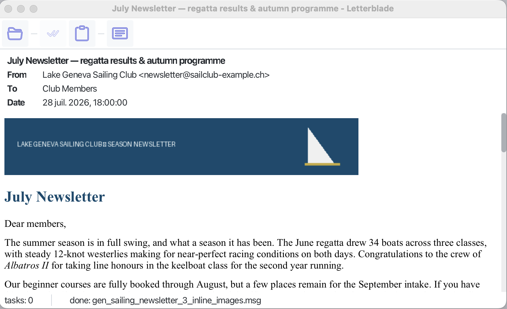

# Letterblade

[](https://github.com/DenissLarka/letterblade/actions/workflows/ci.yml)

[](LICENSE)

**Open and read Outlook `.msg` files on macOS, Windows, and Linux — no Outlook required.**

[](https://github.com/DenissLarka/letterblade/releases/latest/download/Letterblade.dmg)
[](https://druvu.com/downloads/letterblade.html)

Windows and Linux are in preparation.



Someone sends you a `.msg` file. You don't have Outlook — you're on a Mac, on Linux, or you
simply never installed it. Letterblade opens the file and shows you the message the
way it was meant to be read: formatting, inline images, attachments, the works.

## What you get

- **Open it your way.** Drop a `.msg` file onto the window, or use File → Open.
- **The message as intended.** HTML mail renders with its formatting and inline images;
  a plain-text view is one click away.
- **The envelope at a glance.** From, To, CC, date, and subject sit above the message.
- **Attachments, on your terms.** Each attachment appears as a chip — save it to disk, or hand
  it to your usual application. Nothing ever opens by itself.
- **Messages inside messages.** A forwarded message attached as `.msg` opens in its own window,
  attachments and all.
- **Copy that works.** Select all and copy give you clean text from the message itself.

## Private by default

Email is a favourite delivery route for tracking and worse, so Letterblade is careful on your
behalf:

- **Remote images are blocked** until you ask for them. Tracking pixels stay blind; a bar tells
  you how many images were held back, and one click loads them for that message only.
- **Scripts and active content are stripped** before the message is rendered.
- **Attachments never run or open automatically** — you decide what happens to each one.
- **Your mail stays on your machine.** Letterblade reads files locally; nothing is uploaded
  anywhere.

## Which direction next?

Letterblade does one thing today: it opens `.msg` files and treats them with care. Where it
goes from here is decided the honest way: by whoever turns up and asks. So, what do you want?
[Open an issue](https://github.com/DenissLarka/letterblade/issues) (or 👍 an existing one) and
say what you'd use it for:

- **A message that didn't open, or didn't look right** — the most valuable report of all.
  Describe the message rather than attaching it; mail is private, and yours stays that way.
- **More formats** — `.eml`, mbox, or something more exotic.
- **Doing more with a message** — search inside it, print it, save it as PDF or HTML.
- **A dark theme.**
- **Something that isn't on this list** — often the best kind.

## License

Apache-2.0. The heavy lifting of reading the `.msg` format is done by the excellent
[outlook-message-parser](https://github.com/bbottema/outlook-message-parser); HTML
sanitization is handled by [jsoup](https://jsoup.org/).

## Building from source

```
mvn javafx:run
```

---

Letterblade is a [druvu](https://druvu.com) product.
